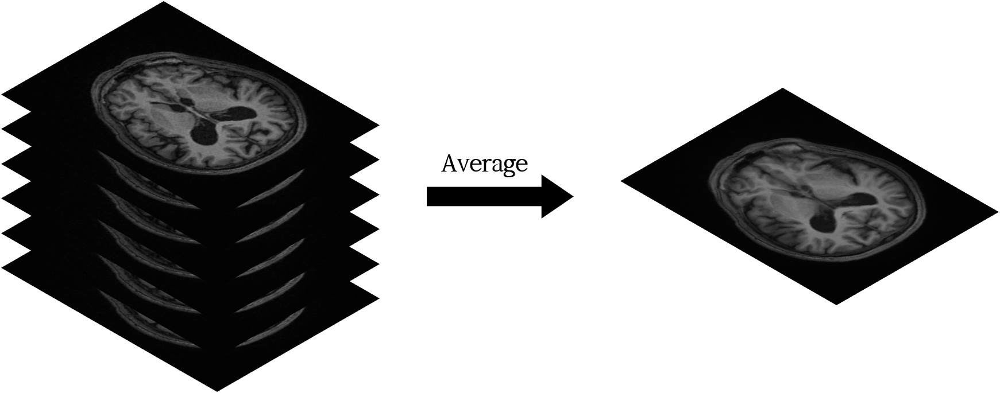

# 3DThick2Thin

---

## Network Concept

Inspired by supre-resolution

Generating Thin MRI 3d volume image from Thick MRI 3d volume image

[thick 2 thin network]

## Dataset

[Calgary-Campinas-359 (CC-359) dataset](https://sites.google.com/view/calgary-campinas-dataset/home?authuser=0)

### Data processing

